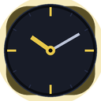

# Chrono Display

A live multi-timezone clock widget Chrome extension. Built from the `clock-widget-v4` mockup.



## Features

- **Live analog clock** with smooth, glowing hands (always tracks wall-clock time).
- **Three timezone cards** — IST, UTC, CT — with an active highlight on IST.
- **12h ↔ 24h conversion scale** showing the current hour mapped across both formats.
- **Time-shift slider** to preview what time it is in each zone at any hour 00–23; double-click the slider to resync to live.
- **Light / dark theme toggle**, remembered across popup opens via `chrome.storage.local`.
- **12H / 24H mode toggle**, also persisted.

## Install (developer mode)

1. Open `chrome://extensions` (works in any Chromium browser: Chrome, Edge, Brave, Arc, …).
2. Toggle **Developer mode** in the top-right.
3. Click **Load unpacked** and select this folder (`wclock/`).
4. Pin the Chrono Display action in the toolbar and click it to open the widget.

## File layout

```
wclock/
├── manifest.json          MV3 manifest
├── popup.html             Popup markup (no inline JS — MV3 CSP compliant)
├── popup.css              Extracted styles (dark + light themes)
├── popup.js               Clock loop, slider, mode/theme, chrome.storage
├── icons/
│   ├── icon16.png
│   ├── icon48.png
│   └── icon128.png
└── scripts/
    └── make_icons.py      Regenerates the icon set with Pillow
```

## Regenerating icons

```bash
python3 scripts/make_icons.py
```

Requires Pillow (`pip install Pillow`).

## Notes on MV3 compliance

The original mockup used inline `<script>` and `onclick="…"` handlers, both of
which violate Manifest V3's default extension CSP. The popup was refactored to:

- Move all JS into `popup.js` (loaded via `<script src>`).
- Replace inline event handlers with `addEventListener` calls.
- Persist user prefs via `chrome.storage.local` (with a graceful `localStorage`
  fallback so `popup.html` still works when opened as a plain file for testing).
- Pause the `requestAnimationFrame` loop while the popup is hidden.

The `permissions` field only requests `"storage"`; no host permissions are
needed since all timezone math is done locally.

## Customising timezones

`TZ` and `offsetLabel` in `popup.js` define the three zones (in minutes from
UTC):

```js
const TZ = { ist: 330, utc: 0, ct: -300 };
const offsetLabel = { ist: '+05:30', utc: '±00:00', ct: '−05:00' };
```

Swap or add zones by editing these objects and the matching `tz-card` blocks in
`popup.html`. Note that `CT` here is treated as a fixed UTC−5 offset
(Central Daylight Time); for full DST-aware timezones, swap the math for
`Intl.DateTimeFormat` with a `timeZone` option.
